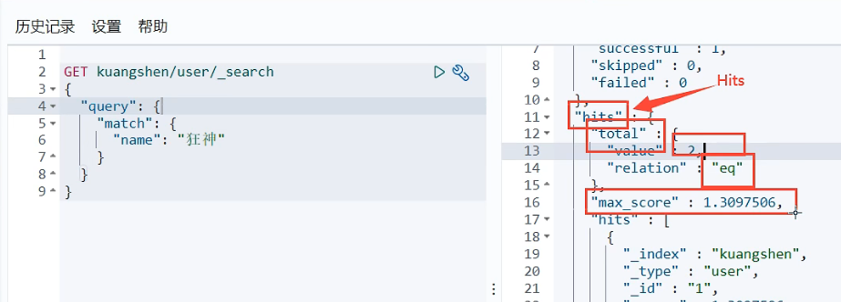
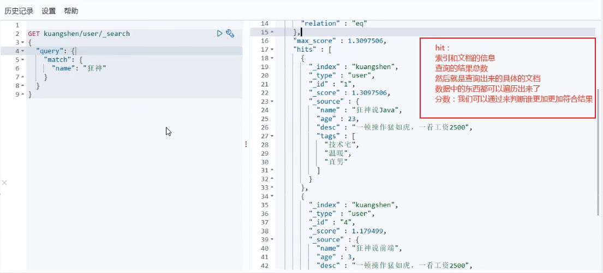
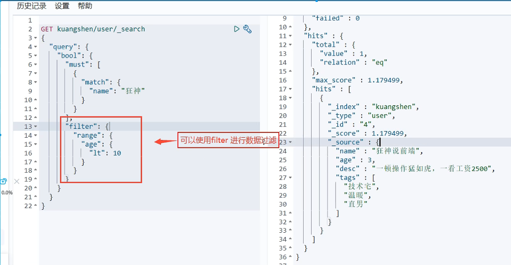
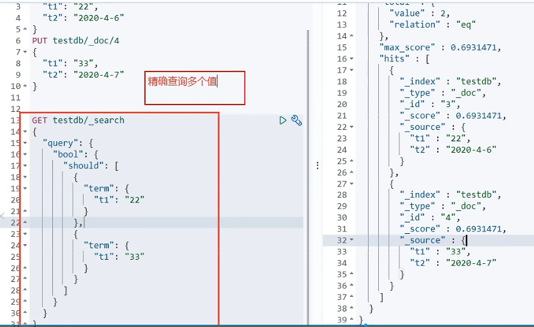
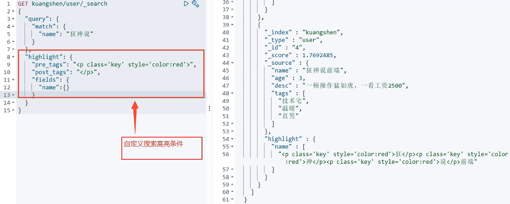
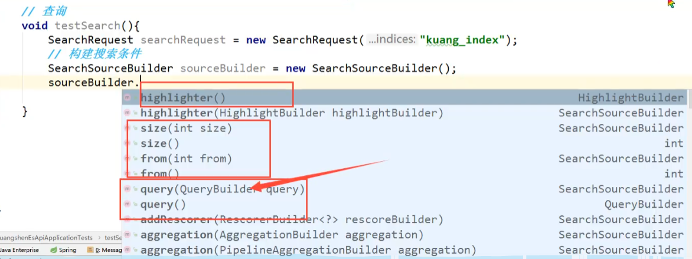

### ES与MySQL的对应关系

| ES          | MySQL
   | ------------- | ------ 
| 索引（indices）   | 数据库（databases）
| types         | 表（table）
| document       | 行（row）
| fileds         | 字段（columns）

### ES语法

1. term 精确查询（相对于match查询效率高，使用了倒排索引）
2. match 使用分词查询（模糊查询）keyword类型的数据不能分词
3. 查询结果Hits对象，包含查询命中的条数及匹配关系
   
4. 查询结果Hits数组
   
5. 查询时指定  _source  查询指定字段，结果过滤
6. 查询 sort 中指定字段中进行升序或者降序
7. 查询分页 用 from 和 size 去指定相当于limit后面两个参数
8. 布尔值查询 bool（多条件查询） 中 must（and）、should（or）、must_not（not） filter（区间查询）->range（范围）->gt（大于），lt，gte（大于等于），lte
   must（and）、should（or）下面都是一个数组，用于多条件查询,在一个字段下可以使用多个条件进行过滤
   
9. match 中字段匹配多个值， 可以使用空格分开 ，查询出的结果都会带有分值，匹配的词越多，分值越大，在查询返回列表的前面
10. 精确查询多个值
    
11. 自定义高亮查询，会在查询的值两边加上标签
    
12. ES中每条数据都可以设置过期规则
13. 查询构建器，build模式
    
14. 搜索分为搜索请求对象，和搜索构造对象，分别构建
15. 查询 SearchRequest 搜索请求 SearchSourceBuilder 条件构造 HighLightBuiLder 构建高亮 TermQueryBuilder 精确查询 MatchALLQueryBuiLder
    匹配全部构造 xxxQueryBuiLder 对应我们刚才看到的命令

16. 基本使用命令文档
    https://blog.csdn.net/qq_42449963/article/details/124003872
17. 查询返回结果解释 按照从上到下的顺序，一共四个返回值，took，timed_out，_shards，hits。 took 该命令请求花费了多长时间，单位：毫秒。 timed_out 搜索是否超时。 shards 搜索分片信息。
    total 搜索分片总数。 successful 搜索成功的分片数量。 skipped 没有搜索的分片，跳过的分片。 failed 搜索失败的分片数量。 hits 搜索结果集。项目中，我们需要的一切数据都是从hits中获取。
    total 返回多少条数据。 max_score 返回结果中，最大的匹配度分值。 hits 默认查询前十条数据，根据分值降序排序。
    _index 索引库名称。
    _type 类型名称。
    _id 该条数据的id。
    _score 关键字与该条数据的匹配度分值。
    _source 索引库中类型，返回结果字段，不指定的话，默认全部显示出来。
 

