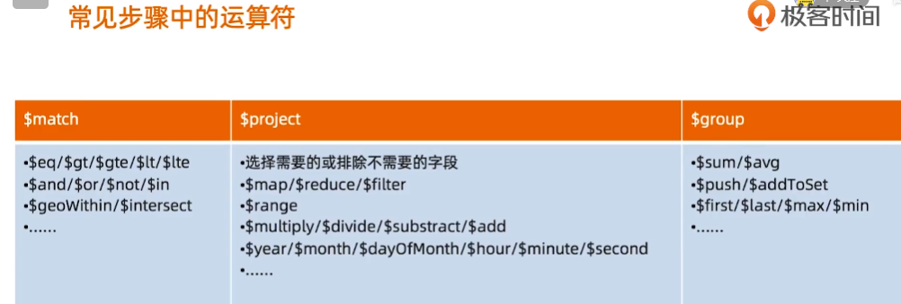

### MongoDB概念

1. 管道和步骤
   
2. 聚合计算的基本格式
   
3. 和MySQL对比 | 步骤 | 作用 | SQL等价运算符 | ------------- | ------ | Smatchr | 过滤 | WHERE | $project | 投影 | AS | $sort | 排序 |
   ORDER BY | $group | 分组 | GROUP BY | $skip/$limit | 结果限制 | SKIP/LIMIT | $lookup | 左外连接 | LEFT OUTER JOIN
4. 常见步骤中的运算符
   
   
5. 使用场景
   
6. MQL 与 SQL 对比
   
   分组用_id指定
   
   数组展开 $unwind
   
   指定字段分组统计 $bucket
   
   多个bucket 同时进行统计 $facet
   
   复杂查询demo
   

7. MongoDB Compass的使用
   

